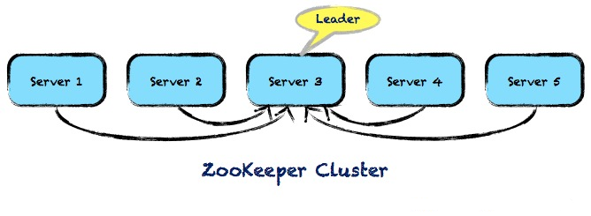

# Zookeeper cluster with Docker




### 利用Host网络模式

如果启动容器的时候使用host模式，那么这个容器将不会获得一个独立的Network Namespace，而是和宿主机共用一个Network Namespace。容器将不会虚拟出自己的网卡，配置自己的IP等，而是使用使用宿主机的IP和端口，不用任何NAT转换，就如直接跑在宿主机中的进程一样。但是，容器的其他方面，如文件系统、进程列表等还是和宿主机隔离的。

我们可以利用host模式来搭建ZK集群。我们可以分别在三台的机器上用host模式启动一个ZK节点，监听2181, 2888, 3888等不同端口。比如三个主机的hostname分别为ZK1，ZK2和ZK3。我们要在不同主机上启动ZK节点。

首先我们需要获得一个Zookeeper的Docker镜像。

1. 下载[Oracle JDK1.8](http://download.oracle.com/otn-pub/java/jdk/8u101-b13/jdk-8u101-linux-x64.tar.gz)和[Zookeeper-3.4.8](http://ftp.riken.jp/net/apache/zookeeper/zookeeper-3.4.8/zookeeper-3.4.8.tar.gz)；
2. `git clone https://github.com/lavenderx/docker-zookeeper.git`至本地，将下载好的JDK和Zookeeper 拷贝至刚刚clone的docker-zookeeper目录下；
3. 运行`docker build -t lavenderx/zookeeper:3.4.8 .`生成Docker镜像。

在ZK1上启动集群的第一个节点：利用环境变量SERVER_ID指明节点ID，并在/opt/zookeeper/conf/zoo.cfg中添加ZK集群节点配置信息，具体请详见Docker镜像的启动脚本[https://github.com/lavenderx/docker-zookeeper/blob/master/run.sh](https://github.com/lavenderx/docker-zookeeper/blob/master/run.sh)

```
docker run -d \
 --net=host \
 -e SERVER_ID=1 \
 -e ADDITIONAL_ZOOKEEPER_1=server.1=zk1:2888:3888 \
 -e ADDITIONAL_ZOOKEEPER_2=server.2=zk2:2888:3888 \
 -e ADDITIONAL_ZOOKEEPER_3=server.3=zk3:2888:3888 \
 lavenderx/zookeeper:3.4.8
```

在ZK2上启动集群的第2个节点

```
docker run -d \
 --net=host \
 -e SERVER_ID=2 \
 -e ADDITIONAL_ZOOKEEPER_1=server.1=zk1:2888:3888 \
 -e ADDITIONAL_ZOOKEEPER_2=server.2=zk2:2888:3888 \
 -e ADDITIONAL_ZOOKEEPER_3=server.3=zk3:2888:3888 \
 lavenderx/zookeeper:3.4.8 
```

在ZK3上启动集群的第3个节点

```
docker run -d \
 --net=host \
 -e SERVER_ID=3 \
 -e ADDITIONAL_ZOOKEEPER_1=server.1=zk1:2888:3888 \
 -e ADDITIONAL_ZOOKEEPER_2=server.2=zk2:2888:3888 \
 -e ADDITIONAL_ZOOKEEPER_3=server.3=zk3:2888:3888 \
 lavenderx/zookeeper:3.4.8
```

采用host方式的好处是直接利用host网络，配置简单、网络性能和原生进程一样，对于关注性能和稳定性的生产环境，host方式是一个较好的选择。

但是如果在开发环境，我们需要将ZK集群部署在一台主机上进行开发测试的时候，我们必须采用手工的方法进行端口管理，来避免端口冲突。

比如，我们可以利用如下脚本配置ZK集群中不同容器

- 第一个容器侦听localhost的2181，2888，3888端口
- 第二个容器侦听localhost的2182，2889，3889端口
- 第三个容器侦听localhost的2183，2890，3890端口
 

```
docker run -d \
 --name=zk1 \
 --net=host \
 -e SERVER_ID=1 \
 -e ADDITIONAL_ZOOKEEPER_1=server.1=localhost:2888:3888 \
 -e ADDITIONAL_ZOOKEEPER_2=server.2=localhost:2889:3889 \
 -e ADDITIONAL_ZOOKEEPER_3=server.3=localhost:2890:3890 \
 -e ADDITIONAL_ZOOKEEPER_4=clientPort=2181 \
 lavenderx/zookeeper:3.4.8

docker run -d \
 --name=zk2 \
 --net=host \
 -e SERVER_ID=2 \
 -e ADDITIONAL_ZOOKEEPER_1=server.1=localhost:2888:3888 \
 -e ADDITIONAL_ZOOKEEPER_2=server.2=localhost:2889:3889 \
 -e ADDITIONAL_ZOOKEEPER_3=server.3=localhost:2890:3890 \
 -e ADDITIONAL_ZOOKEEPER_4=clientPort=2182 \
 lavenderx/zookeeper:3.4.8

docker run -d \
 --name=zk3 \
 --net=host \
 -e SERVER_ID=3 \
 -e ADDITIONAL_ZOOKEEPER_1=server.1=localhost:2888:3888 \
 -e ADDITIONAL_ZOOKEEPER_2=server.2=localhost:2889:3889 \
 -e ADDITIONAL_ZOOKEEPER_3=server.3=localhost:2890:3890 \
 -e ADDITIONAL_ZOOKEEPER_4=clientPort=2183 \
 lavenderx/zookeeper:3.4.8
```
